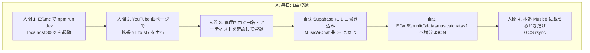
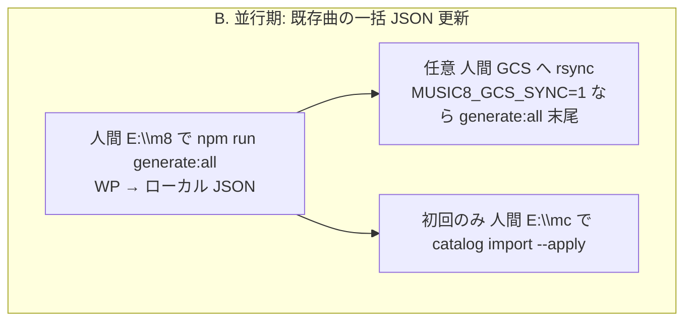
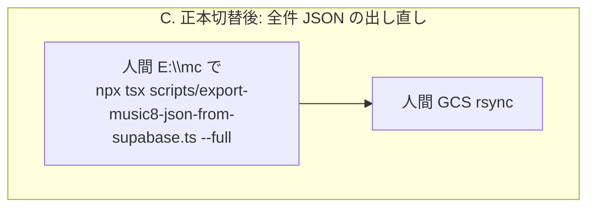

# 曲更新: 人間が実行すること

WP には書き戻さない。正本は MusicAiChat の Supabase。Music8 公開は JSON キャッシュ。

凡例: **人間** = 手で実行する。**自動** = その直後にプログラムがやる。







## A. 毎日（新規・更新 1 曲）

| 順 | 誰 | やること |
|----|----|----------|
| 1 | 人間 | `E:\mc` で `npm run dev`。`http://localhost:3002` が動いていること |
| 2 | 人間 | YouTube の曲ページで Chrome 拡張 **YT to M7**（yttowp は使わない） |
| 3 | 人間 | `/admin/songs/new` で内容を確認して登録 |
| — | 自動 | Supabase に曲と動画が入る = MusicAiChat 曲DB 更新 |
| — | 自動 | その曲の増分 JSON（`musicaichat/v1` の1ファイル + YouTube / アーティスト索引） |
| 4 | 人間 | 公開サイトに載せるときだけ `E:\m8` から GCS rsync（または `MUSIC8_GCS_SYNC=1` の定期生成） |

1〜3 までで MusicAiChat はその曲を使える。Music8 本番は 4 をやるまで古い JSON のまま。

## B. 並行期（今）: WP 更新を JSON に出す

正本切替までは、公開 Music8 の JSON はまだ WP 生成が主。

| 順 | 誰 | やること |
|----|----|----------|
| 1 | 人間 | `E:\m8` で `npm run generate:all`（`scripts/update-all-data.js`） |
| 2 | 任意 | GCS へ上げる（`.env.local` の `MUSIC8_GCS_SYNC=1`、または手動 rsync） |
| 3 | 初回・差分 | `E:\mc` で `npx tsx scripts/import-music8-wp-catalog.ts --songs-dir=E:/m8/public/data/songs --apply` |

## C. 正本切替後: 全件・集計 JSON

1曲登録の増分では出ない集計（`styles_summary.json` など）をまとめて出すとき。

```powershell
cd E:\mc
npx tsx scripts/export-music8-json-from-supabase.ts --full
```

その後、必要なら GCS rsync。

## やらなくてよいこと

- WP 管理画面への曲登録（逆同期しない）
- 1曲ごとに全件 export スクリプトを回すこと
- 1曲ごとに catalog import を回すこと（登録 API が style を載せる）

## 次の UI 改善（カタログ初回投入のあと）

日常の登録を速くする。正本は Supabase のまま。WP のカテゴリ編集画面は使わない方向。

| 対象 | 今の入口 | 直すこと |
|------|----------|----------|
| 1曲登録 | YT to M7 → `/admin/songs/new` の大きい別ウィンドウ | 軽い確認 UI、フル管理画面を毎回開かない |
| アーティスト新規・編集 | `/admin/library/artist`（洋楽）・`/admin/domestic-artist-register`（邦楽）・`/admin/artists-newly-registered` | 項目が多くて遅い。よく使う Origin / Member / Occupation / Spotify / YouTube / Wikipedia をすぐ直せるようにする |

関連: [`00-music8-supabase-canonical.md`](./00-music8-supabase-canonical.md) · [`00-music8-wp-to-supabase-tasks.md`](./00-music8-wp-to-supabase-tasks.md) · [`E:\m8\docs\supabase-source-of-truth.md`](../../m8/docs/supabase-source-of-truth.md)
