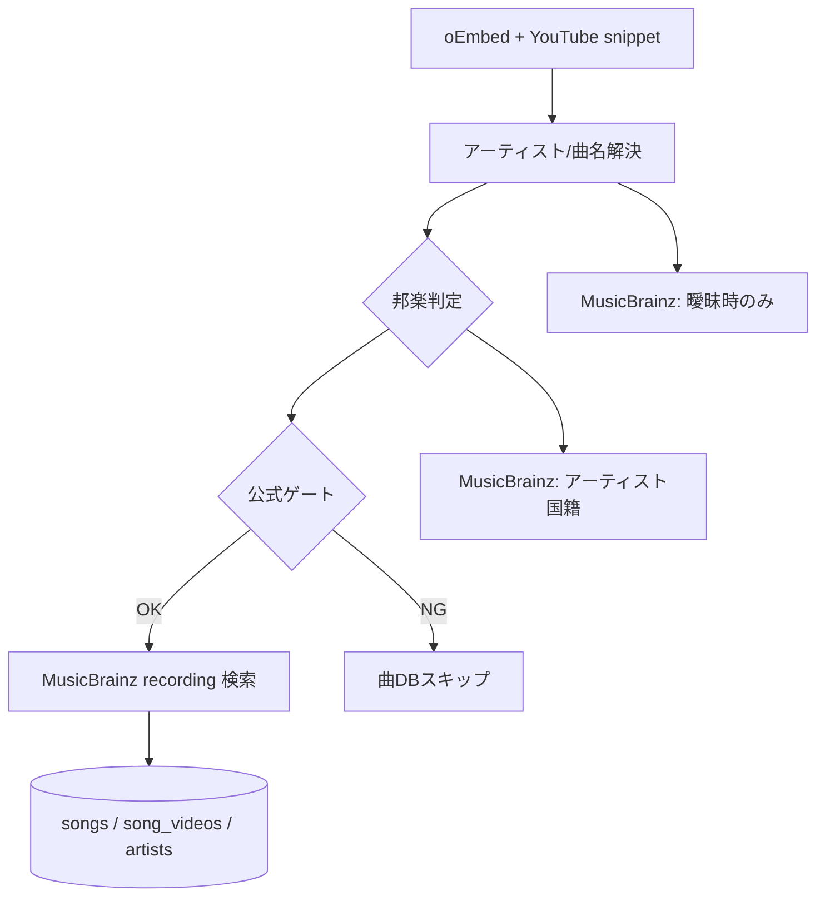

# 邦楽ライト曲 DB プロジェクト

**mc（musicchat）** 向けに、**公式判定を通した邦楽だけ**を選曲実績から蓄積する「ライトな曲マスタ」運用の設計メモです。  
洋楽の **Music8 連携・一括取り込み（約2万曲）とは別経路** とし、物理 DB は `songs` / `song_videos` / `artists` を共用します。

| 項目 | 内容 |
|------|------|
| 状態 | **Phase B–E 実装済み**（2026-07-08）。管理邦楽ビュー（F）・`official_verified` 列（G）は未着手 |
| 主な供給源 | mc 部屋の YouTube URL 選曲（`POST /api/room-playback-history`） |
| 正本スキーマ | `docs/supabase-songs-and-performances-tables.md` |
| 選曲登録の既存仕様 | `docs/song-registration-on-selection-spec.md` |

---

## 1. 目的

1. **邦楽を Music8 に依存せず**、ユーザー選曲に応じてライブラリを育てる。
2. **非公式（カバー・ファン投稿等）は曲 DB に入れない** — 公式シグナル必須のゲートを維持する。
3. 保存項目は **最小限**（アーティスト・曲名・国・リリース日・ジャンル＋動画 ID）に留め、洋楽向けの Music8 / Spotify 厚いメタとは分離する。
4. 部屋ライブラリの **「邦楽」タブ**（`catalog_scope = 'domestic'`）で検索・再選曲できる棚を作る。

**ma（musicaichat）** は洋楽中心・AI 有料。**mc** は邦楽含む無料同期視聴が主な供給源（`docs/00-music-chat-product-plan.md`）。

---

## 2. 設計原則

| 原則 | 説明 |
|------|------|
| テーブルは分けない | 同一の `songs` / `song_videos`。行単位で `catalog_scope = 'domestic'` |
| Music8 非必須 | 邦楽登録経路では Music8 フェッチ・`music8_song_data` 同期を **スキップ**（一致しても洋楽経路にしない） |
| 公式のみ | `src/lib/song-db-registration-gate.ts` の邦楽公式必須ルールを正とする |
| 空欄許容 | ジャンル・リリース日は MB で取れなければ null のまま運用可能 |
| 上書き控えめ | 既に値がある `original_release_date` / `genres` / `origin_country` は **空欄のときだけ補完** |

---

## 3. データモデル（既存列のマッピング）

新規テーブルは不要。**既存列** で表現する。

### 3.1 曲（`songs`）

| 保存したい情報 | 列 | 型 | 備考 |
|----------------|-----|-----|------|
| アーティスト | `main_artist` | text | YouTube 表記解決結果 |
| 曲名 | `song_title` | text | 同上 |
| 日本語読み | `song_title_ja` | text | 任意。英語タイトルのカタカナ等。ライブラリ検索対象。MB aliases があれば自動、なければ手入力 |
| 一覧用 | `display_title` | text | `Artist - Song` |
| 洋楽/邦楽 | `catalog_scope` | text | 邦楽は **`domestic`** 固定 |
| リリース日（原盤） | `original_release_date` | date | MB 優先。YouTube 公開日は代用しない（別列）。ライブラリ新旧ソートは原盤が無いときだけ YT 公開日を使う |
| ジャンル | `genres` | text[] | MB の genres/tags 上位（例: 5件） |
| 再生回数 | `play_count` | int | 選曲のたびに既存ロジックで加算 |

**邦楽では原則使わない列**: `music8_song_id`, `music8_song_data`, `music8_*_slug`, Spotify 系列（`spotify_*`）。

### 3.2 動画（`song_videos`）

| 列 | 備考 |
|-----|------|
| `video_id` | PK |
| `song_id` | FK |
| `variant` | 登録ゲート通過時は `official` |
| `youtube_published_at` | YouTube snippet `publishedAt`（クリップ公開日。原盤日とは別） |

### 3.3 アーティスト（`artists`）

| 保存したい情報 | 列 | 備考 |
|----------------|-----|------|
| 国 | `origin_country` | 邦楽はほぼ **`JP`**（`JPN` / `JAPAN` もフィルタで domestic 扱い可） |
| 表示名 | `name` 等 | `ensureArtistForSongRegistration` 経由 |

国は曲行ではなく **アーティストマスタ** に持つ（邦楽は実質 JP 固定のため `songs` への denormalize は不要）。

### 3.4 将来検討（任意・未実装）

公式判定結果の監査用:

```sql
-- 案（SQL 未実行）
alter table public.songs add column if not exists official_verified boolean not null default false;
alter table public.songs add column if not exists official_verified_at timestamptz null;
alter table public.songs add column if not exists official_signals text[] null;
alter table public.songs add column if not exists library_origin text null; -- 'selection' | 'admin' | 'music8'
```

ゲート通過＝`official_verified = true` とする運用を想定。Phase 1 では必須ではない。

---

## 4. 情報の取得元

### 4.1 YouTube 選曲時（主経路）



| 用途 | ソース | 邦楽ライト DB での扱い |
|------|--------|------------------------|
| 動画メタ | YouTube oEmbed + `videos.list` snippet | 必須 |
| アーティスト・曲名 | YouTube タイトル/概要欄解析 | 基本はこれ。順序曖昧時のみ **MusicBrainz** 録音検索（score のみ） |
| 邦楽かどうか | YouTube メタ + **MusicBrainz** アーティスト検索 + DB `western_treated_jp_artists` | `catalog_scope` 推定に使用 |
| 公式かどうか | **YouTube のみ** | チャンネル ID、概要欄 `Provided to YouTube by`、`(Official Video)` 等 |
| リリース日・ジャンル | **MusicBrainz** recording 検索 | **新規**: 邦楽登録時に取得して保存 |
| 国 | 邦楽判定済みなら **`JP` デフォルト** | `artists.origin_country`。MB で裏取り可 |
| 拡張メタ | ~~Music8~~ | **邦楽経路では使わない** |
| Spotify | 選曲 POST では未使用 | 邦楽では今後も任意 |

### 4.2 MusicBrainz で取る項目（実装予定）

管理プレイリスト import（`src/app/api/admin/youtube-playlist-import/route.ts` の `fetchMusicBrainzMetadata`）と同系:

- `original_release_date` … `first-release-date` / 公式 `releases[].date` の**最古日**（再発・リマスターより原盤優先。検索ヒット複数も横断）
- `genres` … recording の `genres` / `tags` をスコア順に最大 5 件

共有モジュール案: `src/lib/musicbrainz-recording-metadata.ts`（切り出し）

制約: **1 秒 1 リクエスト**、`MUSICBRAINZ_USER_AGENT` 必須。邦楽 1 曲あたり recording 検索 1 回を目安。

実装: `src/lib/musicbrainz-recording-metadata.ts`（`fetchMusicBrainzRecordingMetadata`）

### 4.3 表記解決ルール（邦楽・公式ゲート通過後）

**Gemini は使わない**（mc は `isMcGeminiDisabled()` で一括オフ）。決定的なルールのみ。

#### 優先順位

| 順位 | ソース | 用途 |
|------|--------|------|
| 1 | **MusicBrainz recording 検索** | `artist-credit` + `recording.title` を正本（例: `サカナクション` / `夜の踊り子`）。`original_release_date`・`genres` もここから |
| 2 | **YouTube フォールバック** | MB 未ヒット・低スコア（&lt;88）・API 失敗時。`src/lib/jp-domestic-youtube-title.ts` |

オーケストレーション: `src/lib/domestic-song-registration.ts` → `resolveDomesticSongMetadataForRegistration`

#### YouTube フォールバックの内訳

1. **スラッシュ分割** — `アーティスト / 曲名`（全角・半角 `/`）。`-Music Video-` 等は事前除去
2. **既存 YouTube 解決** — `resolveArtistSongForPackAsync` の artist/song が日本語曲名なら採用（チャンネル名で日本語アーティストを正規化）
3. **チャンネル + タイトル全文** — 上記が無いとき、チャンネルから日本語アーティスト名を取り、装飾除去後のタイトルを曲名に

チャンネル `サカナクション sakanaction` のような日英併記は、**表示・DB とも日本語を優先**（`サカナクション`）。英字 `sakanaction` は `artists.music8_artist_slug` のヒントに使う。

#### 表示と DB の対応

| 項目 | UI（視聴履歴 `title`） | DB（`songs`） |
|------|------------------------|---------------|
| 一覧表記 | `displayTitle`（`Artist - Song`） | `display_title` 同値 |
| アーティスト | `artist_name` | `main_artist` |
| 曲名 | （`title` に含む） | `song_title` |
| 日英二重表記 | UI では許容（YouTube 生タイトルが残ることもある） | **同一アーティスト**として `サカナクション` に正規化 |
| MB 未ヒット | YouTube ルールで `サカナクション - 夜の踊り子` | 同上。`original_release_date` / `genres` は **null / 空** |
| 国 | — | `artists.origin_country = JP`（空欄時のみ） |

#### 既知の誤表記例（修正前）

YouTube タイトル `サカナクション / 夜の踊り子` を、洋楽向け `parseArtistTitle`（ハイフン区切りのみ）で解釈できず、チャンネル名 `サカナクション sakanaction` とタイトル全文を連結していた:

`サカナクション sakanaction - サカナクション / 夜の踊り子`

邦楽経路ではスラッシュ分割 + チャンネル日本語優先で **`サカナクション - 夜の踊り子`** に統一する。

#### Music8 との関係（邦楽）

- 選曲 POST では **Music8 フェッチをスキップ**
- `hasMusic8Match` による登録ゲート bypass は **邦楽では廃止**（洋楽のみ有効）
- `music8_song_data` 同期・Spotify enrich は邦楽ライト経路では行わない

---

## 5. 登録フロー（実装済み）

```
POST /api/room-playback-history
  → resolveArtistSongForPackAsync（YouTube + 曖昧時 MB）
  → resolveJapaneseEconomyWithMusicBrainz（邦楽判定）
  → [mc] 視聴履歴は邦楽も記録（ma は部屋設定で jp_domestic スキップあり）
  → 邦楽かつ公式ゲート OK:
       - Music8 フェッチをスキップ
       - resolveDomesticSongMetadataForRegistration（MB → YouTube）
       - upsertSongAndVideo（domesticLightDb, catalog_scope=domestic）
       - ensureDomesticArtistForSongRegistration + origin_country=JP
  → 非公式邦楽: songs 登録スキップ（jp_unofficial）、mc では履歴のみ
```

実装の中心: `src/lib/song-entities.ts` の `upsertSongAndVideo`、`src/app/api/room-playback-history/route.ts`。

## 6. 現状との差分（ギャップ）

| 項目 | 現状 | ライト邦楽 DB 目標 |
|------|------|-------------------|
| 公式のみ登録 | ○ ゲートあり | 維持 |
| `catalog_scope = domestic` | ○ 登録時に設定可 | 維持 |
| 部屋ライブラリ邦楽タブ | ○ `?catalog=domestic` | 維持・中身を増やす |
| Music8 on 選曲 | ~~邦楽でも取得を試みる~~ | **邦楽はスキップ（実装済み）** |
| Music8 で公式ゲート bypass | ~~`hasMusic8Match` で通過可~~ | **邦楽では廃止（実装済み）** |
| 表記（スラッシュタイトル） | ~~洋楽 parse にフォールバック~~ | **MB / YouTube 邦楽ルール（実装済み）** |
| `original_release_date` | Music8 一致時のみ多い | **MB から補完（実装済み）** |
| `genres` | Music8 一致時のみ | **MB から補完（実装済み）** |
| `artists.origin_country` | ~~選曲登録では未設定~~ | **`JP` を空欄時にセット（実装済み）** |
| 公式判定の永続化 | なし | 任意列で将来対応 |
| 管理ライブラリ | 邦楽行を除外（洋楽寄せ） | 邦楽専用ビュー `?catalog=domestic` を後追い |

---

## 7. 実装フェーズ

| Phase | 内容 | 依存 |
|-------|------|------|
| **A** | 本ドキュメント確定 + 関連 doc へのリンク | — |
| **B** | `musicbrainz-recording-metadata.ts` 共通化 | **完了** |
| **C** | 邦楽経路: MB メタ取得 → `original_release_date` / `genres` を空欄時のみ patch | **完了** |
| **D** | 邦楽経路: Music8 フェッチ・同期スキップ、Music8 公式 bypass 廃止 | **完了** |
| **E** | `artists.origin_country = 'JP'`（domestic 新規・空欄時） | **完了** |
| **F** | 管理画面: 邦楽ライブラリ一覧（新規登録・play_count・メタ表示） | 任意 |
| **G** | `official_verified` 等の列追加 SQL + 登録時書き込み | 任意 |

**最小 MVP**: Phase B + C + D + E（選曲で邦楽が公式メタ付きで溜まる）。

---

## 8. 環境変数・無効化

| 変数 | 効果 |
|------|------|
| `NEXT_PUBLIC_PRODUCT=musicchat` | **mc**: `isMcGeminiDisabled()` が true。Gemini は一切呼ばれない（`getGeminiModel` 一括オフ） |
| `SONG_DB_REGISTRATION_GATE=0` | 登録ゲート全体オフ（非推奨） |
| `SONG_DB_JP_OFFICIAL_ONLY=0` | 邦楽の公式必須オフ |
| `MUSICBRAINZ_LOOKUP=0` | MB 参照オフ（日付・ジャンル補完も止まる） |
| `MUSICBRAINZ_USER_AGENT` | 未設定時は MB を呼ばない |

---

## 9. 運用上の注意

1. **ジャンルは空でもよい** — MB の邦楽タグは洋楽より薄いことが多い。
2. **リリース日** — 取れない場合は null。YouTube `publishedAt` を原盤日にしない（MV 再アップ等でずれる）。
3. **国はほぼ JP** — `western_treated_jp_artists` に載るアーティスト（ONE OK ROCK 等）は洋楽扱いで **domestic ライブラリ対象外**。
4. **重複曲** — 同一 `video_id` は `song_videos` PK で再利用。別 MV の同一曲は別 `video_id` 行になりうる（ライト DB では許容）。
5. **product 分離** — 視聴履歴は `product` スコープ（ma/mc）。曲 DB は共用。

---

## 10. 関連コード・ドキュメント

| 種別 | パス |
|------|------|
| 登録ゲート | `src/lib/song-db-registration-gate.ts` |
| 邦楽表記（YouTube） | `src/lib/jp-domestic-youtube-title.ts` |
| 邦楽表記（MB→YT） | `src/lib/domestic-song-registration.ts` |
| MB recording メタ | `src/lib/musicbrainz-recording-metadata.ts` |
| 邦楽アーティスト登録 | `src/lib/artist-selection-register.ts`（`ensureDomesticArtistForSongRegistration`） |
| upsert | `src/lib/song-entities.ts` |
| 選曲 POST | `src/app/api/room-playback-history/route.ts` |
| 邦楽判定 | `src/lib/resolve-japanese-economy.ts` |
| ライブラリ検索 | `src/app/api/library/search/route.ts` |
| catalog フィルタ | `src/lib/song-catalog-scope.ts` |
| MB 日付・ジャンル（参考） | `src/app/api/admin/youtube-playlist-import/route.ts` |
| スキーマ SQL | `docs/supabase-songs-and-performances-tables.md` § `catalog_scope` |
| mc 製品計画 | `docs/00-music-chat-product-plan.md` |

---

## 11. 変更履歴

| 日付 | 内容 |
|------|------|
| 2026-07-08 | 初版（会話設計の MD 化） |
| 2026-07-08 | mc AI 原価ゼロ: 視聴履歴 style は Music8/キャッシュ/`Other` のみ（Gemini 廃止） |
| 2026-07-08 | Phase B–E 実装: MB/YouTube 表記ルール・選曲 upsert・Music8 スキップ・`origin_country=JP` |
