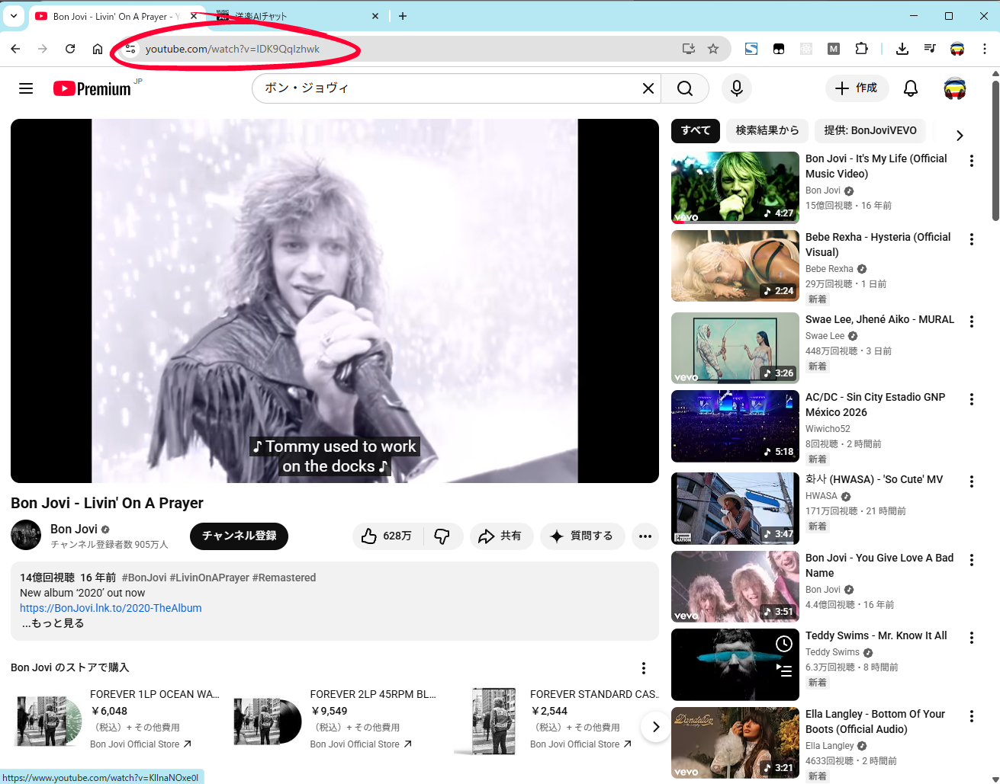
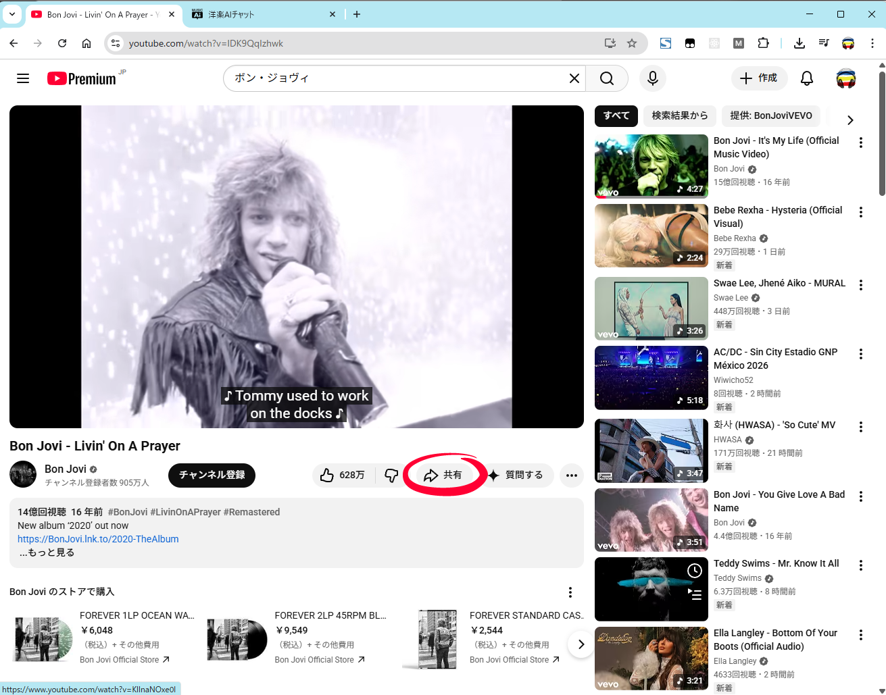
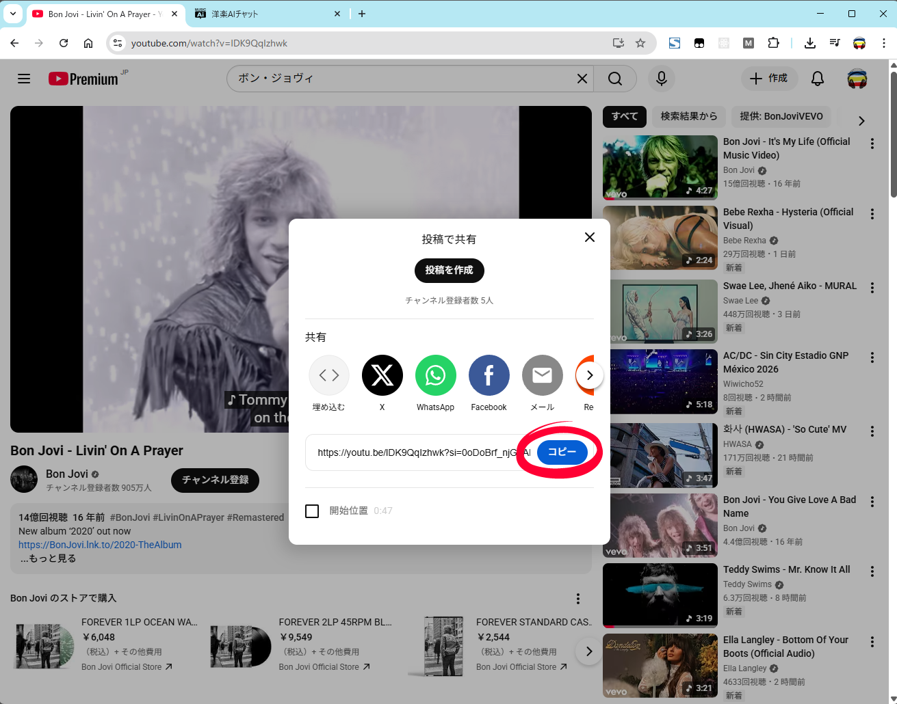
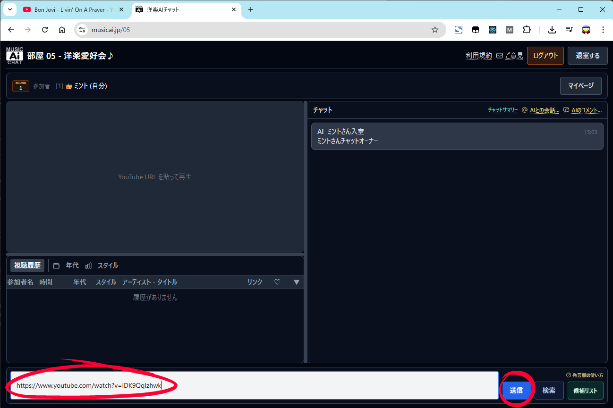
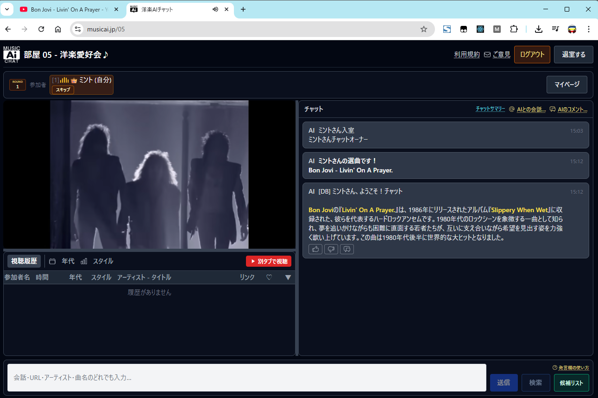

# 初めての方へ：選曲のしかた（MusiAi チャット）

部屋で YouTube の動画を流すには、大きく次の流れになります。

1. **YouTube 側で動画の URL をコピーする**（コピーのやり方は 2 通りあります）
2. **MusiAi の発言欄から選曲する**（**送信**と**検索**の 2 通りがあります）

画面の例は `public/images/first-time-song-selection/` の `sc-01.png`〜`sc-05.png` です（丸印は操作箇所の目印）。

---

## 1. YouTube で URL をコピーする（2 通り）

どちらか好みの方法で構いません。どちらも MusiAi の発言欄に貼り付けられます。

### 方法 A：ブラウザのアドレスバーからコピー

動画ページを開いたとき、画面上部のアドレスバーに `youtube.com/watch?v=...` のような URL が表示されます。

1. アドレスバーの URL をクリックして選択する（またはドラッグで選択）。
2. 右クリックして **「コピー」** を選ぶ。  
   キーボードなら **Ctrl+C**（Mac は **⌘+C**）でもコピーできます。

### 方法 B：「共有」からコピー

動画の下にある **「共有」** をクリックし、表示された窓の中のリンク横の **「コピー」**（青いボタン）を押します。`youtu.be/...` の短い形式でコピーされますが、そのまま MusiAi で使えます。

---

## 2. MusiAi チャットで選曲する（2 通り）

画面下の発言欄に **「発言欄の使い方（送信／検索の2通り）」** とあるとおり、次の 2 通りです。

### 方法 1：URL を貼って「送信」

1. コピーした YouTube の URL を、下の白い入力欄に貼り付けます（**Ctrl+V** / **⌘+V**）。
2. 青い **「送信」** ボタンを押します。

YouTube の URL のときは、チャットではなく**部屋のプレイヤーにその動画が表示**されます（会話文はそのままチャットに出ます）。

### 方法 2：曲名などを入れて「検索」

1. アーティスト名・曲名などの**キーワード**を入力欄に入れます。
2. **「検索」** を押すと、この画面の上に**候補動画の一覧**（最大 5 件）が開きます。
3. 一覧の中から **「プレビュー」** で内容を確認したり、**「今すぐ貼る」** でその動画を再生したりできます。部屋の設定によっては **「候補」** でリストに追加する操作もあります（プレビューを少し見たあとに押せるようになることがあります）。

※ 入力欄の **「？」発言欄の使い方** を押すと、アプリ内でも同様の説明が開きます。

---

## 3. うまくいったときの目安

- チャット側に、**「○○さんの選曲です！」** のような AI の案内が出ることがあります。
- 左のプレイヤーに動画が表示され、**視聴履歴**の表に 1 行追加されることがあります。

---

## 補足

- **YouTube 以外の URL** を送ると、プレイヤーではなく案内メッセージになることがあります。
- **「検索」** を使うには、サーバーに YouTube Data API の設定（`YOUTUBE_API_KEY`）がある必要があります。検索が使えない環境では、**URL をコピーして「送信」** の方法が確実です。
