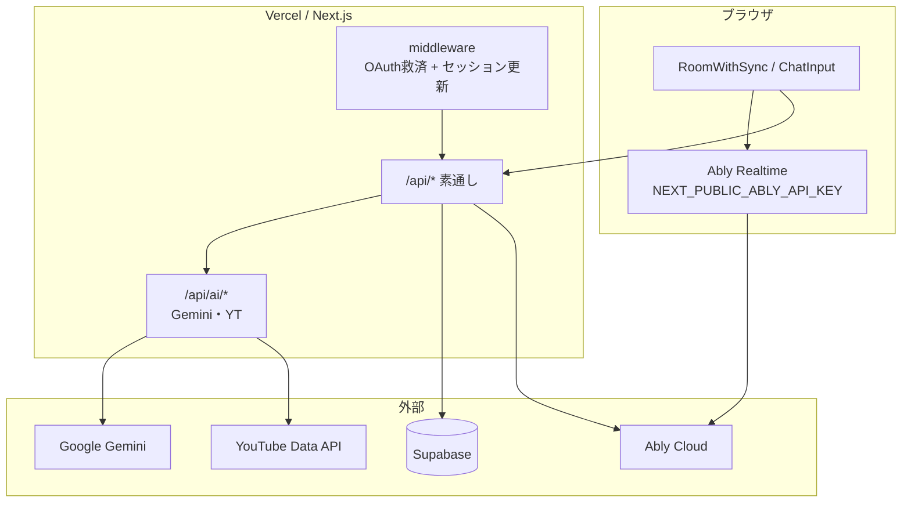

# 洋楽AIチャット（ma）敵対的検証レポート

> **対象サービス**: [洋楽AIチャット（β版）](https://musicai.jp/)（musicaichat / `NEXT_PUBLIC_PRODUCT` 未設定または ma ビルド）  
> **検証日**: 2026-07-17  
> **修正反映**: 2026-07-17（コード改善実装）  
> **方法**: コードベース静的解析（`e:\mc`）、既知インシデント・運用ドキュメント照合。**本番への破壊的操作・大量コスト攻撃は実施していない**  
> **関連**: `docs/abuse-moderation-future-tasks.md`・`docs/incident-20260705-musicai-jp-production.md`・`AGENTS.md`

---

## 0. 修正状況（2026-07-17）

| 項目 | 状態 | 主な変更 |
|------|------|----------|
| Ably 公開キー | **修正済** | `ABLY_API_KEY` + `NEXT_PUBLIC_ABLY_ENABLED=1` + `/api/ably/token`（部屋チャネル限定 capability）。`NEXT_PUBLIC_ABLY_API_KEY` は使用しない |
| character-chat / resolve-song-request | **修正済** | 在室ゲート＋コスト RL。resolve はログイン必須 |
| comment-pack / commentary / song-quiz | **修正済** | 共有 RL。`isGuest` はサーバ判定。お試しテーブル欠落は fail-closed。`packPhase` 省略は消費 |
| room-chat-log IDOR / 汚染 | **修正済** | GET/POST に在室・参加／STYLE_ADMIN ゲート＋書き込み RL |
| STYLE_ADMIN PATCH | **修正済** | 未設定時は全拒否（`/admin` と同一） |
| 質問ガード直 POST | **修正済** | `/api/ai/chat` でサーバ再検証（既定 fail-closed） |
| YouTube announce / feedback / 履歴 POST | **修正済** | 共有 RL |
| Admin jsonUrl SSRF | **修正済** | https・プライベート IP 拒否 |
| エッジ WAF / BAN / キック | **残課題** | `docs/abuse-moderation-future-tasks.md` 参照 |

### 運用で必要な環境変数（移行）

```text
ABLY_API_KEY=...                 # サーバ専用（旧 NEXT_PUBLIC_ABLY_API_KEY の値を移す）
NEXT_PUBLIC_ABLY_ENABLED=1      # クライアントで Token Auth を有効化
# NEXT_PUBLIC_ABLY_API_KEY は削除すること

AI_TRIAL_ENFORCEMENT_ENABLED=1  # 本番推奨
STYLE_ADMIN_USER_IDS=uuid,...
# 任意: AI_QUESTION_GUARD_SERVER_FAIL_OPEN=1  # 分類障害時に通す（非推奨）
# 任意: SAFE_FETCH_ALLOWED_HOSTS=storage.googleapis.com,...
# 任意: TRUST_X_FORWARDED_FOR=0  # プロキシなし環境
```

`/api/ai/status` の `securityHardening.warnings` で危険な未設定を検出できる。

---

## 1. エグゼクティブサマリ（検証時点の所見）

洋楽AIチャットは **同期視聴（Ably）＋ Gemini AI（曲解説・@ 質問・進行）** を中核とする β サービス。敵対者視点では次の3系統が主な攻撃面であった（上記「修正状況」でコード側は対応済み／残課題あり）。

| 深刻度 | 攻撃面 | 要約 |
|--------|--------|------|
| **Critical** | **Ably API キーのクライアント露出** | （旧）`NEXT_PUBLIC_ABLY_API_KEY` がブラウザに配信 |
| **Critical** | **未認証・無枠の AI コスト経路** | （旧）character-chat / resolve-song-request |
| **Critical** | **お試し強制の env 依存** | `AI_TRIAL_ENFORCEMENT_ENABLED=1` でない限り枠なし（運用確認が必要） |
| **High** | **部屋チャットログ IDOR** | （旧）認証なし GET |
| **High** | **サーバーレス・インメモリ RL** | インスタンス単位。エッジ併用は残課題 |
| **Medium** | **質問ガード fail-open** | クライアントは従来どおり。サーバは fail-closed に変更 |
| **Medium** | **STYLE_ADMIN 未設定時の PATCH 開放** | fail-closed に変更済み |

**相対的に堅い点**: `/api/admin/*` と `/admin` UI は `STYLE_ADMIN_USER_IDS` 必須（空リスト＝全拒否）。Cron は `CRON_SECRET` Bearer 必須。`/api/ai/chat` はゲスト拒否。姉妹サイト mc は middleware で `/api/ai/*` を 404 遮断。

---

## 2. 検証スコープと前提

### 2.1 対象

- 公式 URL: **https://musicai.jp/**（本番 ma ビルド想定）
- コード: 本リポジトリ（ma / mc 共用。`src/lib/product-branding.ts`・`src/lib/product-mode.ts` で分岐）

### 2.2 検証観点（敵対者モデル）

| モデル | 目的 |
|--------|------|
| 匿名攻撃者 | コスト焼き・API 濫用・データスクレイプ |
| ゲスト参加者 | チャット荒らし・Ably なりすまし・偽ログ注入 |
| 登録ユーザー（悪意） | 枠回避・質問ガード迂回・他ユーザー情報収集 |
| 内部者／設定ミス | env 誤設定による全開放 |

### 2.3 実施しなかったこと

- 本番 Gemini / YouTube / Ably への大量リクエスト
- 他ユーザーの部屋への乗っ取り実証
- `CRON_SECRET` 等のブルートフォース

ステージングまたは許可されたペネトレーション環境での実証は別途推奨。

---

## 3. アーキテクチャ上の信頼境界



**弱点**: 同期・チャット・選曲順の多くが **Ably 上のクライアント信頼**に依存。サーバは `/api/*` を middleware で保護せず通過（`src/middleware.ts` L28–29）。

---

## 4. 詳細所見

### 4.1 Critical — Ably キー露出と部屋同期

**根拠**: `src/components/providers/AblyProviderWrapper.tsx` が `process.env.NEXT_PUBLIC_ABLY_API_KEY` を `Ably.Realtime` に渡す。

| リスク | 説明 |
|--------|------|
| チャネル乗っ取り | 攻撃者が DevTools 等でキーを取得し、任意 `room:{id}` に接続 |
| なりすまし | 任意 `clientId` で presence・メッセージ publish |
| 再生同期改ざん | オーナー心拍・選曲イベントがクライアント発行の場合、権限昇格の余地 |
| コスト | Ably メッセージ・presence 洪水（過去インシデントで presence が全体の約 90% を占めた事例あり） |

**過去実害**: `docs/incident-20260705-musicai-jp-production.md` — 1 時間ライブで Ably presence **30 万メッセージ超**、Supabase Nano 枯渇、504。

**推奨対策**: Token Auth（サーバ発行の capability 制限付きトークン）、チャネル名の推測困難化、WAF / Ably アプリ制限、presence 頻度の見直し。

---

### 4.2 Critical — AI コスト濫用

#### 4.2.1 お試し・課金ガード（env 依存）

`src/lib/ai-trial-status.ts`: `AI_TRIAL_ENFORCEMENT_ENABLED === '1'` のときのみ enforcement。

`src/lib/user-ai-trial-server.ts` `guardAiTrialSongSelection`:

- enforcement オフ → 常に `{ ok: true }`
- `user_ai_trial` テーブル欠落（`missingTable`）→ `{ ok: true }`（fail-open）
- `packPhase !== 'base'`（frees 等）→ base 消費なしで Gemini 生成が走る経路あり

**影響 API**: `comment-pack`・`commentary`・`song-quiz`・`next-song-recommend` 等。

#### 4.2.2 未認証・軽ガードのエンドポイント

| エンドポイント | 認証 | レート制限 | お試し枠 | 備考 |
|----------------|------|------------|----------|------|
| `POST /api/ai/character-chat` | 不要 | IP のみ | **なし** | `forceReply: true` で毎回 Gemini |
| `POST /api/ai/resolve-song-request` | 不要 | **なし** | なし | `extractSongSearchQuery` 直呼び |
| `POST /api/ai/comment-pack` | Cookie 任意 | **なし** | enforcement 依存 | 重い多段 Gemini + YT |
| `POST /api/ai/commentary` | 同上 | なし | 同上 | 同上 |
| `POST /api/ai/song-quiz` | 同上 | **なし** | 同上 | 曲解説後の追加呼び出し |
| `POST /api/ai/tidbit` | 不要 | なし | — | `NEXT_PUBLIC_DISABLE_TIDBIT_AI≠0` で既定無効 |
| `POST /api/ai/chat` | **ログイン必須**（ゲスト 403） | IP あり | enforcement 時 | 比較的堅い |
| `POST /api/ai/question-guard-classify` | 不要 | あり | — | 分類そのものが Gemini コスト |

**攻撃シナリオ例**

1. `character-chat` を bot で連打 → Gemini 課金・レイテンシ悪化
2. enforcement オフ（または本番 misconfig）で `comment-pack` + 任意 `videoId` → 曲解説フル生成
3. `resolve-song-request` 無制限 → 選曲意図抽出の Gemini 焼き
4. `packPhase=frees` 指定で base 消費を避けつつ生成

#### 4.2.3 YouTube クォータ

`announce-song`・`comment-pack`・`search-youtube`・`paste-by-query` 等が `videos.list` / `search.list` を消費。認証なしまたは弱い経路からの乱打が可能。

#### 4.2.4 月次予算サーキット

`AI_MONTHLY_VARIABLE_BUDGET_ENABLED` 未設定時は原価リミッター無効（コード上の既定）。

---

### 4.3 High — IDOR・データ漏洩・汚染

#### 4.3.1 部屋チャットログ（最重要 IDOR）

`GET /api/room-chat-log`（`src/app/api/room-chat-log/route.ts` L99–170）:

- **認証チェックなし**
- `roomId` のみで `room_chat_log` を最大 **8000 行**取得
- `format=json`・`download=1` 対応

対比: `GET /api/room-playback-history` は在室・参加履歴ゲートあり（`src/lib/room-playback-history-access.ts`）。

**攻撃**: 部屋 ID を総当たり／推測して会話・表示名・AI 応答を収集。

#### 4.3.2 偽ログ・履歴注入

| エンドポイント | 弱点 |
|----------------|------|
| `POST /api/room-chat-log` | 認証任意。任意 `roomId` に偽会話を DB 投入可 |
| `POST /api/room-playback-history` | 弱い認証。視聴履歴汚染 |
| `POST /api/room-access-log` | ゲストは `visitorKey`（UUID）のみ |

管理画面の課金推定・チャット要約が汚染データに依存する場合、間接的影響あり。

#### 4.3.3 その他の情報露出（読み取り）

| エンドポイント | 内容 |
|----------------|------|
| `GET /api/room-presence` | 在室者・人数 |
| `GET /api/room-session-summary` | セッション要約 |
| `GET /api/room-playback-style-stats` / `era-stats` | 部屋統計 |
| `GET /api/ai/status` | Gemini / YT 設定有無・予算概況 |
| `GET /api/library/*` | ライブラリ検索（認証なしで利用可な経路あり） |

---

### 4.4 Medium — 質問ガードとチャット悪用

#### 4.4.1 fail-open 設計

`src/lib/client-ai-question-guard-resolve.ts`:

- `NEXT_PUBLIC_AI_QUESTION_GUARD_DISABLED=1` → 常に allow
- `AI_QUESTION_GUARD_GEMINI=0` → API skipped → allow
- HTTP 429 / 5xx / タイムアウト（6s）/ `skipped` → **allow**
- **block は `musicRelated: false` のときのみ**

サーバ `POST /api/ai/chat` はクライアント側ガード結果を**再検証しない**。

**バイパス**: 分類 API を意図的にタイムアウトさせる、または `/api/ai/chat` を UI 経由せず直接叩く（ログイン＋枠があれば）。

#### 4.4.2 ゲスト・荒らし

- Ably 上の表示名はクライアント設定。サーバ側の発言権限なし
- ゲストの `clientId` はブラウザごとに分離されるが、IP 追跡は困難（`docs/abuse-moderation-future-tasks.md`）
- オーナー／モデレーターのキック・ミュートは将来課題（M8）

#### 4.4.3 免除 UID

`AI_DEVELOPER_UNLIMITED_USER_IDS`・`AI_SUPPORTER_UNLIMITED_USER_IDS`・`ai-question-guard-exempt-user-ids.ts` — env / ハードコード誤設定で無制限・退場免除。

---

### 4.5 Medium — 認可の不整合

#### STYLE_ADMIN の二重意味

`src/lib/style-admin.ts`:

- `isStyleAdminUserId`: **`STYLE_ADMIN_USER_IDS` 空 → 全ログインユーザー true**
- `isChatStyleAdminUserId`: 空 → **false**（チャット開発者ツールは付与しない）

`PATCH /api/room-playback-history`（L627–642）: `adminIds.length > 0` のときだけ管理者チェック。**空なら誰でも PATCH 可**。

`/admin` UI は `admin-access.ts` で **空リスト＝誰も不可**（安全側）。

→ **管理 UI は閉じていても、playback-history PATCH だけ開いている** misconfig パターン。

---

### 4.6 Low〜Medium — インフラ・運用

| 項目 | 所見 |
|------|------|
| **レート制限** | `src/lib/chat-ai-rate-limit.ts` — プロセス内 Map、最大 5000 IP。マルチインスタンスで効きが薄い |
| **IP 取得** | `x-forwarded-for` 先頭を信頼 — プロキシ構成次第でスプーフ可能 |
| **middleware** | `/api` は `getUser()` なしで素通し。Auth 障害時の 504 リスクはページ側（過去インシデント） |
| **Cron** | `GET /api/cron/end-empty-live-gatherings` — `Authorization: Bearer CRON_SECRET` 必須。漏洩時は live 強制終了 |
| **Admin SSRF** | `POST /api/admin/artist-master-import-json` 等の `jsonUrl` fetch — STYLE_ADMIN 前提の管理者 SSRF 面 |
| **プロンプト注入** | `recentMessages`・`commentaryContext` 経由で Gemini プロンプト汚染（品質・コスト攻撃） |

---

## 5. 環境変数ミスコンフィグ一覧

| 変数 | 未設定 / 誤設定時の影響 |
|------|-------------------------|
| `AI_TRIAL_ENFORCEMENT_ENABLED` ≠ `1` | 選曲 AI の枠・消費ガード無効 |
| `STYLE_ADMIN_USER_IDS` 空 | playback-history PATCH 全開放（管理 UI は閉鎖） |
| `NEXT_PUBLIC_ABLY_API_KEY` | 同期の信頼境界がクライアントに露出 |
| `NEXT_PUBLIC_AI_QUESTION_GUARD_DISABLED=1` | `@` ガード無効 |
| `AI_QUESTION_GUARD_GEMINI=0` | 分類スキップ＝常に通す |
| `AI_DEVELOPER_UNLIMITED_*` / `AI_SUPPORTER_UNLIMITED_*` | 指定 UID が無制限 |
| `NEXT_PUBLIC_DISABLE_TIDBIT_AI=0` | tidbit Gemini 有効化 |
| `NEXT_PUBLIC_AI_CHARACTER_TTS_ENABLED=1` | 未認証 TTS 経路 |
| `CRON_SECRET` 弱い / 漏洩 | cron 悪用 |
| `NEXT_PUBLIC_PRODUCT=musicchat` | ma 向け `/api/ai/*` が 404（mc ビルドでは AI 面が閉じる） |

---

## 6. 推奨ペネトレーション・テストケース（優先順）

| # | テスト | 期待（現状） | 深刻度 |
|---|--------|--------------|--------|
| 1 | ブラウザから Ably キー抽出 → 別部屋チャネル subscribe/publish | 接続成功の可能性 | Critical |
| 2 | 未ログインで `POST /api/ai/character-chat` 連打 | 429 まで Gemini 応答 | Critical |
| 3 | `POST /api/ai/resolve-song-request` 連打 | 無制限に近い Gemini 呼び出し | Critical |
| 4 | 本番 `AI_TRIAL_ENFORCEMENT` 状態確認後、`comment-pack` を `aiMode:full` で呼ぶ | オフなら枠なし生成 | Critical |
| 5 | `GET /api/room-chat-log?roomId=03&format=json`（認証なし） | 200 + 会話 JSON | High |
| 6 | `POST /api/room-chat-log` で偽メッセージ投入 | DB に反映 | High |
| 7 | 質問ガード: 非音楽 `@` + 分類 API 6s タイムアウト | メッセージ送信可（fail-open） | Medium |
| 8 | `X-Forwarded-For` ローテーションで chat RL 回避 | インスタンス跨ぎで部分回避 | Medium |
| 9 | `STYLE_ADMIN` 空環境で `PATCH room-playback-history` | 200 で改ざん可 | Medium |
| 10 | `GET /api/cron/end-empty-live-gatherings`（Bearer なし） | 401/403 | Low（期待どおり） |

**実施場所**: ステージングまたは明示許可された本番読み取りのみ。1・2・3 はコスト・可用性に影響するため本番連打禁止。

---

## 7. 緩和策ロードマップ（既存 ToDo との対応）

`docs/abuse-moderation-future-tasks.md` の課題番号にマッピング:

| 優先 | 対策 | ToDo |
|------|------|------|
| P0 | Ably Token Auth + capability 制限 | （新規・インフラ） |
| P0 | `character-chat` / `resolve-song-request` に認証または厳格 RL + お試し連動 | M12 拡張 |
| P0 | 本番 `AI_TRIAL_ENFORCEMENT_ENABLED=1` の運用確認・テーブル欠落時 fail-closed 検討 | — |
| P1 | `room-chat-log` GET に在室 / 主催 / 参加履歴ゲート | M6 |
| P1 | WAF・エッジ RL（Vercel / Cloudflare） | M4 |
| P1 | `comment-pack` / `song-quiz` に IP・ユーザー RL | M12 |
| P2 | 登録ユーザー BAN・通報・オーナーキック | M2, M8, M9 |
| P2 | ゲスト投稿クールダウン | M10 |
| P3 | インシデント手順・規約整合 | M13, M14 |

---

## 8. 過去インシデントとの関係

2026-07-05 の本番障害（`docs/incident-20260705-musicai-jp-production.md`）は、敵対的検証で示した攻撃面の **「可用性・コストの自然発生版」** と重なる。

- Gemini・曲解説・@・エージェント選曲の集中 → AI コスト面の実証
- Ably presence 急増 → メッセージング層のボトルネック
- middleware `getUser()` + Supabase 枯渇 → **全站 504**（認証基盤が単一障害点）

敵対者が意図的に同パターンを再現すれば、PRO 移行後も **Ably / Gemini / YT クォータ**で再びサービス劣化が起きうる。

---

## 9. 結論

洋楽AIチャット（ma）は、β サービスとして **UX（ゲスト参加・fail-open ガード）とセキュリティ・コスト防御のトレードオフ**がコードに明示されている。最大リスクは次の3点:

1. **Ably フルキー露出**による同期・チャット境界の崩壊  
2. **AI API の認証・枠・RL 抜け**（特に `character-chat`・`resolve-song-request`・enforcement オフ）  
3. **`room-chat-log` の認証なし読み取り**によるプライバシー侵害  

本番運用では env 正本の定期監査、エッジ RL、Ably Token Auth、チャットログのアクセス制御を最優先で検討することを推奨する。

---

## 10. 参考コードパス

| 領域 | パス |
|------|------|
| Ably クライアント | `src/components/providers/AblyProviderWrapper.tsx` |
| middleware | `src/middleware.ts` |
| お試しガード | `src/lib/user-ai-trial-server.ts`・`src/lib/ai-trial-status.ts` |
| チャット AI RL | `src/lib/chat-ai-rate-limit.ts` |
| 質問ガード | `src/lib/client-ai-question-guard-resolve.ts` |
| チャットログ | `src/app/api/room-chat-log/route.ts` |
| キャラ AI | `src/app/api/ai/character-chat/route.ts` |
| 選曲意図 | `src/app/api/ai/resolve-song-request/route.ts` |
| STYLE_ADMIN | `src/lib/style-admin.ts` |
| 荒らし ToDo | `docs/abuse-moderation-future-tasks.md` |
