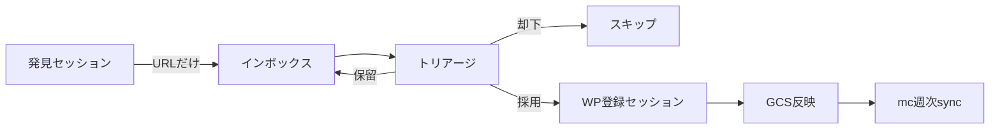

# 新曲収集ワークフロー改善プラン

更新: 2026-06-07

## 背景

- **現状**: 週末に YouTube ホーム（AI 並び）から新曲を視聴し、アーティスト・ジャンル等を確認して WordPress（Music8）に登録。
- **規模**: 昨年おおよそ 2,000〜3,000 曲（公開日 2025 で最低値を確認可能）。
- **課題**: ルーチン自体は苦ではないが時間を要し、**その日の気分で収集数にバラツキ**が出る。新曲収集は M8 / MC 運営に欠かせない作業。

---

## 課題の本質

バラツキの主因は、次の 3 フェーズが **1 セッションに混ざっている** こと。

| フェーズ | 内容 | 気分依存度 |
|----------|------|------------|
| **発見** | YouTube を眺めて「これいい」と思う | 高い（楽しい） |
| **判定** | 洋楽か、新曲か、公式 PV か、重複か | 中〜高 |
| **登録** | アーティスト・ジャンル・スタイル・公開日を WP に入力 | 低〜中（手間） |

発見のエネルギーがそのまま登録まで続くかで週次件数が決まる。YouTube ホームのアルゴリズムも日々変わるため、**同じ週末でも候補密度が違う**。

---

## 方針：「収集」と「登録」を分離する

最優先の改善。**コード不要**で始められる。

### フェーズ1：発見（気分が乗る日）

- **やること**: 候補の URL をインボックスに入れるだけ（**1 曲 30 秒以内**を目標）
- **やらないこと**: ジャンル確定、WP 入力、説明文
- **第一歩（採用）**: **YouTube プレイリスト**にどんどん追加

### フェーズ2：登録（集中できる日）

- インボックス（プレイリスト）を上から処理
- 既に聴いた曲は再視聴不要（メモがあれば十分）
- **週末でなく平日夜 30 分** でも回せる

「今週は発見だけ」「来週は登録だけ」が可能になり、**年間総数の平準化**に効く。

---

## 第一歩：YouTube プレイリスト・インボックス

### 運用中のインボックス（2026-06-07〜）

| 項目 | 値 |
|------|-----|
| プレイリスト名 | **20260607** |
| URL | [https://www.youtube.com/playlist?list=PLiFQRXqw2IFItaSafJ4z37yPuhi21fc4F](https://www.youtube.com/playlist?list=PLiFQRXqw2IFItaSafJ4z37yPuhi21fc4F) |
| プレイリスト ID | `PLiFQRXqw2IFItaSafJ4z37yPuhi21fc4F` |

発見セッションではこのプレイリストへ **30 秒/曲** で追加。WP 登録が終わった曲はプレイリストから削除（または「登録済み」用プレイリストへ移動）。

**MC 暫定取り込み（任意）**: 管理画面 [`/admin/youtube-playlist-import`](/admin/youtube-playlist-import) に上記 URL を貼り、まず dry-run → 問題なければ本番。WP 正規登録前でも `songs` / `song_videos` に暫定メタが入る。

### セットアップ

1. ~~プレイリストを 1 本作る~~ → **20260607** を使用中
2. 公開設定は **非公開** または **限定公開**（運用しやすい方）
3. 発見セッションのルールを固定する:
   - **1 曲 30 秒以内**で「保存」または「プレイリストに追加」
   - ジャンル・スタイルは考えない
   - 迷ったら入れて、トリアージで却下

### 発見セッションの目安

| 項目 | 目標 |
|------|------|
| 時間 | 15〜30 分 |
| 追加数 | **週 30 URL**（下限） |
| やらないこと | WP 登録、説明文、重複の深い確認 |

### トリアージ（登録前・週 1 回でも可）

プレイリストを上から見て、即却下する条件:

- 既に M8 に同曲（`video_id` または artist + title で把握）
- カバー／ライブのみ／ lyrics video のみ
- 洋楽以外
- 宣伝・プロモ系（長い宣伝文タイトル等）

却下はプレイリストから削除。採用分だけ WP 登録セッションへ。

### 登録セッション

- プレイリストを上から処理（**週 20 曲**を下限目安）
- 1 曲あたり: 視聴済みならメタ入力中心。未視聴なら短く確認してから WP
- 登録完了した曲はプレイリストから削除（または「登録済み」プレイリストへ移動）

### MC 連携（任意・後から）

週中に貯めたプレイリストは、必要に応じて MC 管理の **YouTube プレイリスト一括取り込み**（`/admin/youtube-playlist-import`）で DB に暫定投入できる。WP 正規登録 → GCS → 週次 sync の流れは [`00-music8-weekly-mc-sync.md`](./00-music8-weekly-mc-sync.md) 参照。

---

## 発見源の分散（ホーム依存を下げる）

YouTube ホーム 1 本だと、アルゴリズムと気分の両方に左右される。ホームは **拾い漏れ埋め** に降格し、主ソースを固定ルートに 2〜3 本。

| ソース | 長所 | 使い方の例 |
|--------|------|------------|
| **YouTube プレイリスト（インボックス）** | 週をまたいで貯められる・30 秒追加 | **第一歩（現在）** |
| **YouTube 登録チャンネル**（レーベル・Vevo・COLORS 等） | 新曲が構造的に流れる | 週 1 回「登録チャンネル」タブ |
| **Spotify New Music Friday 等** | リリース日が明確 | プレイリスト → YouTube 公式 PV 検索 → インボックス |
| **MC 部屋の選曲** | 既に視聴済み・需要あり | [`/admin/library-music8-pending`](./music8-library-import-notes.md) |
| **YouTube ホーム** | 偶然の発見 | 補助的に |

---

## 既存インフラの活用

M8 / MC には **チャット先行 → 後から M8 正規化** の設計がある（[`music8-library-import-notes.md`](./music8-library-import-notes.md) の運用モデル）。

| 用途 | 参照 |
|------|------|
| 部屋で流れたが M8 未連携の曲 | `/admin/library-music8-pending` |
| プレイリスト → MC DB 暫定投入 | `/admin/youtube-playlist-import` |
| WP JSON → GCS → mc DB | [`00-music8-weekly-mc-sync.md`](./00-music8-weekly-mc-sync.md) |
| YouTube 視聴中に URL を部屋へ | Chrome 拡張 [`chrome-extension-musicaichat.md`](./chrome-extension-musicaichat.md) |
| 曲 JSON スキーマ・正本 | [`music8-song-json-schema.md`](./music8-song-json-schema.md) |

---

## 品質を保ったまま時短する

M8 の価値は **ジャンル・スタイル・ボーカル・公開日の正確さ**。ここは人間確認を残し、前後を機械化する。

### WP 入力の事前埋め（登録セッション前）

- **oEmbed / YouTube snippet** → タイトル・チャンネル（MC の `resolveArtistSongForPackAsync` と同系）
- **MusicBrainz** → アーティスト・曲名・リリース年
- **Spotify track** → 正式タイトル・公開日・ジャンル候補

人間が決めるのは主に **M8 固有のスタイル分類** と **説明文の要否**。

---

## 目標設計：下限＋バッファ

| 指標 | 例 | 目的 |
|------|-----|------|
| **週次キャプチャ下限** | 30 URL | 発見だけでも達成しやすい |
| **週次登録下限** | 20 曲 | WP 側の実績 |
| **インボックス上限** | 100 件 | 溜めすぎ防止 |
| **4 週ローリング平均** | 40 曲/週 | 単週のブレを見ない |

**公開日 2025** の件数は登録 KPI。**プレイリスト残件数** も併記すると「発見はできているが登録が遅れている」が見える。

### バッファ週

- **高エネルギー週**: 発見 60 + 登録 40（バッファ +20）
- **低エネルギー週**: 発見 15 + 登録 20（バッファから消費）
- **繁忙期**: 登録のみ（プレイリスト消化）

年間 2,500 曲 ≒ 週 48 曲だが、毎週 48 は不要。**8 週に 1 回 100 曲週** があれば、他は 20〜30 でも年間計画に乗る。

---

## 中長期：MC/M8 に足すと効くもの（検討候補）

優先度の高い順。

1. **新曲インボックス API / 管理画面** — URL 列 → oEmbed/MB 自動プレビュー → 「WP 登録済み」チェック
2. **Spotify New Releases → 候補リスト** — 週 1 バッチ、YouTube 公式 PV 検索リンク付き
3. **WP 下書き一括生成** — JSON/CSV → WP REST API で draft（人間が公開・スタイル確認）
4. **重複チェック** — 追加時に `youtube_to_song.json` / DB 照合
5. **週次レポート** — `releaseDate 2025` の今週追加、インボックス残、pending 数

---

## やらない方がよいこと

- **ジャンル・スタイルの完全自動登録** — M8 の差別化が薄れる
- **ホーム視聴時間の延長** — 発見と登録を分離した方が総時間は減る
- **週末に全部やる縛り** — 登録は平日分割の方が平準化しやすい

---

## 今週から（チェックリスト）

- [x] YouTube プレイリスト **20260607** を作成（[リンク](https://www.youtube.com/playlist?list=PLiFQRXqw2IFItaSafJ4z37yPuhi21fc4F)）
- [ ] 発見セッション: **30 秒/曲** で URL 追加のみ（目標 30 件/週）
- [ ] 別日に登録セッション（目標 20 件/週）
- [ ] 月 1 回 `library-music8-pending` を確認し、部屋由来候補を WP に回す
- [ ] 公開日 2025 の件数を週次メモ（4 週平均を見る）

---

## 関連

- [`music8-library-import-notes.md`](./music8-library-import-notes.md) — チャット先行 → M8 手動登録の運用モデル
- [`00-music8-weekly-mc-sync.md`](./00-music8-weekly-mc-sync.md) — 週次 DB 同期
- [`music8-song-json-schema.md`](./music8-song-json-schema.md) — 曲 JSON 正本
