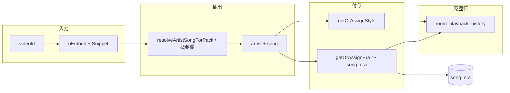

# 視聴履歴：スタイル・時代・アーティスト抽出の拡張設計（今後用）

部屋の**視聴履歴**（`room_playback_history` とその周辺）を、マイページの「貼った曲」「お気に入り」などへ展開する前提で、**スタイル・時代・アーティスト**をどう扱うかの設計メモです。実装は未着手でも参照できるよう、現状と差分を明示します。

## 1. 現状（As-Is）

### 1.1 `room_playback_history` に既にあるもの

| 項目 | 保存場所 | 備考 |
|------|-----------|------|
| **スタイル** | 行の `style` 列 | POST 時に `getOrAssignStyle` で決定し INSERT。GET でそのまま返る。STYLE_ADMIN の PATCH で更新可。 |
| **表示タイトル** | `title` | 多くは `アーティスト - 曲名` 形式（`formatArtistTitle` / 管理者上書き反映後）。 |
| **アーティスト（抽出結果）** | `artist_name` | POST 内で `resolveArtistSongForPackAsync`・概要欄パース・チャンネル名フォールバック等のあと、`artist ?? effectiveAuthor` を格納。管理者 `video_playback_display_override` があれば上書き。 |
| **時代** | 行には**ない** | `song_era` テーブル（`video_id` PK）に集約。GET 時に `video_id` で `IN` 結合し、レスポンスの `era` に載せている。 |

実装の中心: `src/app/api/room-playback-history/route.ts`（POST で style / artist 決定・INSERT、GET で `song_era` 結合）。

### 1.2 時代が `song_era` のみである意味

- **利点**: 同じ `video_id` への再計算を避け、一覧では常に「最新の年代ラベル」に揃えやすい。
- **欠点**: 「当時その再生で表示されていた時代」と履歴行が**1:1で固定されない**（後から Music8 / AI で `song_era` が更新されると、過去行の見え方も変わる）。

マイページ側の `user_song_history` / `user_favorites` は **style / era を未保持**（別ドキュメント・コード参照）。

## 2. 求められる能力（要件の整理）

1. **スタイル** … 視聴履歴上で既に実質満たしている。拡張としては「表示・集計・エクスポートの統一」「他テーブルへのコピー」が主題。
2. **時代** … 一覧・エクスポートで確実に出したい場合、**行スナップショット**と**マスタ参照**のどちらを正とするかを決める必要がある。
3. **アーティスト抽出** … 既に `artist_name` はあるが、**抽出経路・信頼度・複数アーティスト（feat.）**などを将来区別したい場合の余地を設計に含める。

## 3. 設計方針（To-Be）— 推奨オプション

### 3.1 スタイル

- **短期**: 変更なし。`room_playback_history.style` を正とする。
- **展開**: `user_song_history` / `user_favorites` に `style text null` を追加し、**INSERT 時に** `video_id` から `songs` / 直近の履歴 / `getOrAssignStyle` のいずれかで**コピーまたは再解決**（負荷と整合のトレードオフ）。
- **注意**: スタイルは曲・動画に紐づく概念が強いので、長期的には `songs` / `song_videos` 側をマスタとし、履歴行はスナップショット列でよい。

### 3.2 時代 — 2 層モデル（推奨）

| 層 | 役割 |
|----|------|
| **マスタ** | 既存の `song_era`（`video_id` → 現在の年代ラベル）。 |
| **スナップショット（任意の新列）** | `room_playback_history.played_era` のような列で、**INSERT 時点**の `getOrAssignEra` 結果を保存。 |

**GET の返し方（案）**:

- `era_snapshot`: 行にあればそれ（NULL 許容・後方互換用）。
- `era`: `era_snapshot ?? song_era 結合` のようにフォールバック。

**マイグレーション**: 既存行は NULL のまま、表示は従来どおり `song_era` で埋める。必要ならバッチで `video_id` ごとに当時値を再現できないため、**過去行はマスタ寄せのみ**と割り切るのが現実的。

### 3.3 アーティスト抽出の「強化」

現状の `artist_name` は単一文字列。**追加を検討する列・メタデータ（すべて任意）**:

| 案 | 内容 |
|----|------|
| `artist_credit_raw` | YouTube タイトル / oEmbed からの生のクレジット断片（デバッグ・再パース用）。 |
| `song_title_normalized` | 曲名だけを分離した列（`title` が結合表示でも検索しやすくする）。 |
| `artist_extraction_source` | 列挙値例: `oembed_resolve` / `description_parse` / `channel_title` / `admin_override` / `musicbrainz`（将来）。 |
| `feat_artists` | text または jsonb（feat. 列挙）。表示要件が出てからでよい。 |

**原則**: 抽出ロジックは既存の `resolveArtistSongForPackAsync` / `parseArtistTitleFromDescription` を**単一の関数出口**に寄せ、INSERT 直前で上記メタをまとめて書くと保守しやすい。

## 4. データフロー（POST 時）

拡張時は `assign` の直後に **スナップショット列**（`played_era` 等）へコピーするだけで、GET の結合ロジックを段階的に切り替えられる。

## 5. 下流（マイページ・お気に入り）への展開

| テーブル | 現状 | 拡張案 |
|----------|------|--------|
| `user_song_history` | title, artist, selection_round 等 | `style`, `played_era`（または `era`）を追加。POST `/api/song-history` で `video_id` から解決 or クライアントが部屋履歴と同じ解決結果を送る（セキュリティ上はサーバー側解決推奨）。 |
| `user_favorites` | title, artist_name 等 | 同上。お気に入り登録 API でオプション付与 or バックグラウンド補完ジョブ。 |

**お気に入りは視聴履歴行から追加**されるため、理想的には **履歴行 ID 参照**（`playback_history_id uuid null`）を持ち、スタイル・時代はそこからコピーまたは JOIN（正規化の好みで選択）。

## 6. API・型

- `RoomPlaybackHistoryRow`（`route.ts`）に `played_era` 等を足す場合は **後方互換**のため `era` は計算プロパティとして残すか、フロントを同時更新。
- PATCH（STYLE_ADMIN）で `played_era` を触るかは**通常不要**（時代の手修正は別 UI が必要なら別エンドポイント）。

## 7. 実装フェーズ案

| フェーズ | 内容 |
|----------|------|
| **P0** | ドキュメント・型の整理（本書）。UI は視聴履歴テーブルに style / era 列を既存どおり活用。 |
| **P1** | `room_playback_history.played_era`（名称は任意）追加 + POST でスナップショット保存 + GET フォールバック。 |
| **P2** | アーティスト抽出メタ列（`artist_extraction_source` 等）の最小セット + 管理画面デバッグ表示。 |
| **P3** | `user_song_history` / `user_favorites` へのコピーとマイページ表示・TEXT エクスポート。 |

## 8. リスク・オープンクエスチョン

- **song_era 更新で過去表示が変わる**問題を許容するか、スナップショット必須にするか。
- **artist_name と title の重複**（結合 `title` と `artist_name` の役割分担）を検索・集計でどう扱うか。
- バッチ再計算のコスト（全履歴への style/era バックフィルは Gemini/Music8 課金に注意）。

## 9. 関連パス

- 視聴履歴 API: `src/app/api/room-playback-history/route.ts`
- 年代: `src/lib/song-era.ts`、`song_era` テーブル（`docs/supabase-song-era-table.md`）
- スタイル: `src/lib/song-style.ts`、`SONG_STYLE_OPTIONS`
- 視聴履歴 UI: `src/components/room/RoomPlaybackHistory.tsx`
- 貼った曲 API: `src/app/api/song-history/route.ts`
- お気に入り API: `src/app/api/favorites/route.ts`
