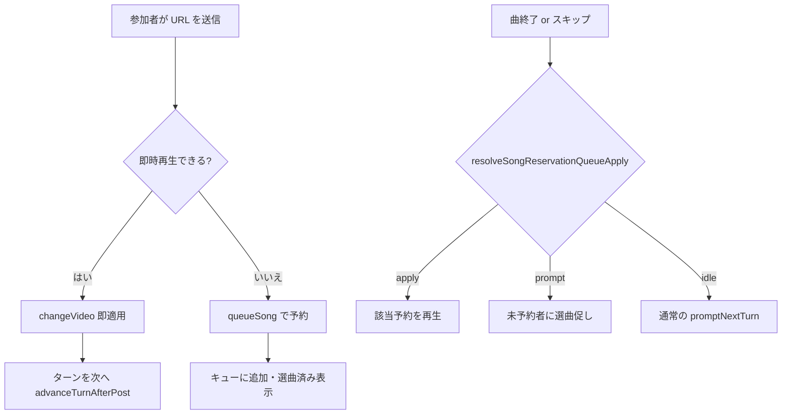

# 同期部屋の選曲順・予約キュー仕様

最終更新: 2026-07-05

同期部屋（`RoomWithSync`）における **選曲ターン**・**選曲予約キュー**・**パス**・**オーナー操作** の基本ルールと、イレギュラー時の扱いをまとめる。非同期部屋（`RoomWithoutSync`）は対象外。

## 用語

| 用語 | 説明 |
|------|------|
| **選曲輪（ring）** | `participatesInSelection === true` かつ在室・非退席枠の参加者を、入室順に並べたリスト。ターンはこの輪上を進む。 |
| **currentTurnClientId** | いま選曲を促す対象の `clientId`。Ably `room:turnState` で全員同期。 |
| **選曲ラウンド** | オーナー（または輪にオーナーがいなければ最古参加者）の番に戻ったタイミングで +1。`sessionStorage` に短期保持（`src/lib/room-selection-round.ts`）。 |
| **協調役** | 表示順 `[1]` の在室・選曲参加・人間参加者。予約通知・曲終了後のキュー適用・パス時の `TURN_STATE` 配信などを担う。 |
| **オーナー** | `ownerClientId` が在室している間の部屋管理者。👑・5分制限の切替・選曲者指名・オーナースキップ等。 |
| **選曲予約キュー** | 再生中や5分制限下で即時差し替えできない曲を FIFO 的に保持する配列。各エントリは `publisherClientId`・`videoId` 等を持つ。 |
| **パス予約** | 自分の番がまだ来ていないときに「パス」を送ると登録。番が来たら自動でパスし、次の人へ進む。 |

## 基本フロー



1. 参加者が YouTube URL を貼って送信する。
2. **複数人**かつ **5分制限 ON** かつ **再生中（または曲終了直後の猶予内）** のときは、オーナー含め全員 **即時 `changeVideo` せず `queueSong`** へ回す（`shouldDeferMultiSongPost`）。
3. キューが1件でも残っている間は、上記に加え **再生中・曲終了猶予中は常に予約経由を強制**（`shouldForceReservationQueueWhilePending`）。
4. 即時再生時は投稿者分のキュー行だけ除去し、**他参加者の予約は維持**（`removePublisherReservationFromQueue`）。旧仕様の「キュー全消し」は廃止。
5. 曲終了（またはスキップ）後、協調役／投稿者が `resolveSongReservationQueueApply` に従い **apply** または **prompt** を実行する。
6. 選曲投稿後は `advanceTurnAfterPost` でターンを次の在室・選曲参加者へ進め、必要なら選曲ラウンドを更新する。

## 即時再生 vs 予約の判定

`shouldDeferMultiSongPost()` が `true` のとき送信は `queueSong` のみ。

| 条件 | 即時 | 予約 |
|------|------|------|
| 参加者1人 | ○ | — |
| 表示名が全員同一（テスト用多重タブ等） | ○ | — |
| 5分制限 OFF | ○（再生中でも可） | — |
| 未再生（videoId なし） | ○ | — |
| 再生中＋開始から5分未満 | — | ○ |
| 曲終了直後の猶予ウィンドウ内 | — | ○ |
| キューが1件以上残存 | — | ○（再生中・猶予中は特に強制） |

AI キャラの自動選曲も同系の `shouldAiCharacterUseReservationQueue` で、再生セッション中は原則キューへ。

## キュー適用順（ターン順優先）

**FIFO 先頭だけを見ない。** `resolveSongReservationQueueApply`（`src/lib/song-reservation-queue-order.ts`）が正本。

`currentTurnClientId` から選曲輪を巡回し:

| 結果 | 意味 | 動作 |
|------|------|------|
| **prompt** | ターン順で先の参加者が未予約 | その人を `currentTurn` にし、選曲促し（再生しない） |
| **apply** | ターン順で先の予約済み参加者を発見 | その人のキュー行（FIFO 先頭でなくても可）を次曲として適用 |
| **idle** | 輪が空 or キュー空 | 通常フローへ |

### イレギュラー例: AI が先に予約

並び: ろん → ハチ → AI。ハチが未選曲のまま AI だけ予約。

- 旧: キュー先頭（AI）を即 apply → ろん・ハチが飛ばされる。
- 現: `prompt` でハチ（または輪上の先の未予約者）へ。AI の予約はキューに残り、順番が回ってから apply。

### イレギュラー例: 直接選曲でキューが消える

- 旧: 誰かが再生中に直接 `changeVideo` するとキュー全消し＋クライアント不整合。
- 現: 投稿者自身の予約行のみ削除。`changeVideo` ペイロードに `reservationQueue` を載せ全員同期。

## パス

発言欄の **パス**（および `pass`・`スキップ`・`次へ` 等、`isPassPhrase` 参照）で処理。

### 即時パス（自分の番）

- 条件: `senderId === currentTurnClientId`、またはキュー `prompt` 対象と一致（ターン表示ずれの救済）。
- 全クライアントで `currentTurnClientId` を次へ更新。
- **協調役のみ** `TURN_STATE` 配信とチャット案内。
- 次の人が予約済みなら「予約曲は終了後に再生」＋他参加者へ「○○さんの選曲待ち」。
- 未予約なら次の選曲者本人にだけ「次の曲を貼ってください」。

### パス予約（まだ自分の番でない）

- `passTurnReservationClientIds` に追加（参加者欄に「パス予約」表示）。
- 自分の番が来たら自動パス（`useEffect` で検知し協調役が案内）。
- 再度「パス」で予約取消。

### 注意

- 自分のチャットエコーではパスを再処理しない（`senderId !== myClientId` のときのみ Ably 経由で処理）。
- `addSystemMessage`（パス通知・スキップ通知等）は従来どおり **ローカル表示のみ**（他端末には出ない）。

## スキップ（曲の途中終了）

| 操作者 | 権限 |
|--------|------|
| いま流れている曲の選曲者 | 自分の曲をスキップ可 |
| オーナー（在室） | オーナースキップ可 |
| 協調役（オーナー不在・5分猶予中のみ） | オーナースキップを **代理** 可 |

`skipToEnd` 受信後、キューに次曲があれば送信者クライアントだけが `applyImmediateChangeVideo`（重複曲解説防止）。協調役が「○○さんの曲がスキップされました」をローカル表示。

スキップ後の選曲促しは **次の選曲者本人のみ** に AI メッセージ。他参加者はシステム「○○さんの選曲待ち」（`audienceClientId` / `audienceExcludeClientId`）。

## オーナー: 選曲者指名

オーナー（またはオーナー不在時の協調役代理）が参加者を指名。

| 指名先の状態 | 動作 |
|--------------|------|
| 予約キューに曲あり | その予約を即 `applyImmediateChangeVideo`（`preserveReservationQueue: true`） |
| 未予約 | `currentTurn` を指名先にし、本人に選曲促し |

UI: 参加者欄の「選曲者指名（代理）」ボタン → `OwnerPickSelectorModal`。

## オーナー不在と協調役代理

1. オーナー退室 → `ownerLeftAt` 記録。👑非表示、`canUseOwnerControls` false。
2. **5分猶予**（`OWNER_ABSENCE_MS`）: 同じ `clientId` が復帰すればオーナー復帰。
3. 猶予中: **協調役のみ** 選曲者指名・オーナースキップを代理（`isActingOwnerPlaybackProxy`）。
4. 5分経過後: 在室のうち **最古入室者** にオーナー自動引き継ぎ（`ownerLeftAt` クリア）。

協調役が退室案内を1回配信:「○○さんが退室しました。5分以内に復帰がなければ、△△さんにオーナーを引き継ぎます。」

## 選曲促しの表示対象

複数人参加時（`participatingOrder.length > 1`）:

| 対象 | メッセージ |
|------|------------|
| 次の選曲者本人 | AI「○○さん、次の曲を貼ってください」（5分経過時は接頭辞付き）。AI 曲直後は URL 貼り付けヒント＋CTA |
| その他の参加者 | システム「○○さんの選曲待ち」（`audienceExcludeClientId` で本人には非表示） |

実装: `promptSelectorTurnMessages`・`publishSelectorWaitingMessage`・`src/lib/chat-message-audience.ts`。

単独参加時は従来どおり全員向け（実質本人のみ）の AI 促し。

## 予約の確認・取消

- 予約済み参加者に「選曲済み」表示。クリックで `SongReservationManageModal`（プレビュー・削除）。
- 取消は `cancelQueueSong` を Ably 送信。

## 曲終了後のキュー適用役割

| 状況 | 誰が apply / prompt するか |
|------|---------------------------|
| 終了した曲の投稿者が在室 | 投稿者（`imPoster`） |
| 投稿者不在・協調役在室 | 協調役 |
| 投稿者在室・キューは prompt | 協調役が prompt 案内 |
| 投稿者在室・キューは apply だが投稿者が動かない | 協調役がフォールバックタイマー後に apply |

## イレギュラー事例一覧

| # | 状況 | 期待動作 |
|---|------|----------|
| 1 | AI が先に予約、前の人が未選曲 | 前の人へ `prompt`。AI 予約は保持 |
| 2 | ろん未選曲・ハチが先に予約 | ろんへ `prompt`（ターン順優先） |
| 3 | ろんが「パス」、ハチは予約済み | ターン進行。「ハチの予約曲は終了後に再生」。**「選曲待ち」は出さない**。曲終了済みなら即キュー適用 |
| 4 | オーナー（または代理）が AI 曲をスキップ | スキップ者だけ選曲促し。他は「○○さんの選曲待ち」 |
| 5 | 再生中に別参加者が直接選曲 | 投稿者分のみキュー除去。他予約は維持＋`reservationQueue` 同期 |
| 6 | オーナー退出 | 5分猶予。協調役に指名・スキップ代理。超過で最古在室者へ引き継ぎ |
| 7 | パス予約者の番が来た | 自動パス→次へ。協調役が案内 |
| 8 | ターンとキュー prompt がずれているが本人がパス | キュー `prompt` 対象と一致すれば即時パス扱い |

## 実装ファイル（主要）

| 領域 | パス |
|------|------|
| 本体ロジック | `src/components/room/RoomWithSync.tsx` |
| キュー順序 | `src/lib/song-reservation-queue-order.ts` |
| 選曲ラウンド | `src/lib/room-selection-round.ts` |
| 表示対象 | `src/lib/chat-message-audience.ts` |
| オーナー・猶予 | `src/lib/room-owner.ts` |
| UI | `UserBar.tsx`・`SongReservationManageModal.tsx`・`OwnerPickSelectorModal.tsx` |
| 型 | `src/types/chat.ts`・`src/types/playback.ts` |

## 単体テスト

```bash
npx tsx src/lib/song-reservation-queue-order.unit-test.ts
npx tsx src/lib/chat-message-audience.unit-test.ts
```

## 未対応・既知の制約

- `passTurnReservationClientIds` は sync スナップショット中心。Ably 常時同期は未整備。
- `addSystemMessage` は他端末に伝播しない（ローカル通知のみ）。
- ユーザー名クリックで発言欄へ名前挿入は **PC（lg）のみ**。

## 関連ドキュメント

- 会（live）全般: `docs/room-live-session-spec.md`
- プロジェクト索引: `AGENTS.md`
