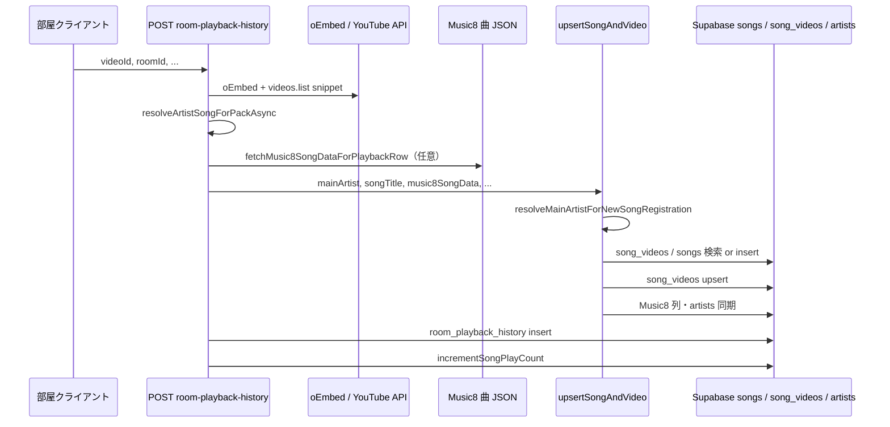

# 選曲時の曲・アーティスト DB 登録 — 項目とロジック仕様

部屋で YouTube URL を選曲（またはライブラリから動画を選ぶ）したとき、**曲マスタ `songs`**・**動画対応 `song_videos`**・任意で **アーティストマスタ `artists`** に何が書かれるかを整理する。

スキーマの SQL 定義は `docs/supabase-songs-and-performances-tables.md`。項目の横断一覧は `docs/recorded-data-fields.md`。Music8 一括取り込み（2万曲）とは別経路。

---

## 1. いつ登録されるか（トリガー）

| 経路 | API / 処理 | `upsertSongAndVideo` | 備考 |
|------|------------|----------------------|------|
| **選曲・再生（主経路）** | `POST /api/room-playback-history` | ○ | oEmbed + YouTube snippet → アーティスト／曲名解決 → upsert → `play_count` +1 |
| 曲解説パック | `POST /api/ai/comment-pack` | ○（`variant: tidbit`） | 視聴履歴より先／並行で走ることがある |
| 曲解説（単体） | `POST /api/ai/commentary` | ○ | 同上 |
| 豆知識 | `POST /api/ai/tidbit` | ○ | 同上 |
| `@` チャット（曲 URL 含む） | `POST /api/ai/chat` | ○ | URL 検出時 |
| 次に聴くなら（試験） | `POST /api/ai/next-song-recommend` | ○（条件付き） | 提案曲の videoId があるとき |
| 管理プレイリスト import | `POST /api/admin/youtube-playlist-import` | ○ | バッチ（選曲 UI 外） |

**ライブラリから選曲**でも、クライアントは通常 **視聴履歴 POST** を送るため、上記「主経路」と同じ `upsertSongAndVideo` が再度走る（既存 `video_id` なら `song_id` を再利用）。

実装の中心: `src/lib/song-entities.ts` の `upsertSongAndVideo`。

---

## 2. 全体フロー（主経路: 視聴履歴 POST）

### 2.1 アーティスト・曲名の決定（DB 書き込み前）

| ステップ | モジュール | 出力 |
|----------|------------|------|
| oEmbed | `fetchOEmbed` | `title`, `author_name` |
| YouTube snippet | `getVideoSnippet` | `description`, `channelTitle`, `publishedAt`, … |
| **表記解決** | `resolveArtistSongForPackAsync`（`youtube-artist-song-for-pack.ts`） | `artist`, `artistDisplay`, `song` |

`resolveArtistSongForPackAsync` の優先:

1. 有名 PV 固定表（`youtube-famous-pv-override`）— `trustProvidedTitleOverFamousPv` 時はスキップ  
2. **`YT_ARTIST_TITLE_MODE=mylist_oembed`** — oEmbed の簡易 `Author - Title` のみ（検証用）  
3. タイトル曖昧時 **MusicBrainz** 録音検索で左右どちらがアーティストか判定  
4. 既定: `getArtistAndSong`（`format-song-display.ts`）＋ snippet 概要欄／チャンネル名で補完  

`getArtistAndSong` の要点:

- タイトルから `(Official Video)` 等を除去（**Remix / Remaster は残す**）  
- ` - ` で分割。先頭2セグメントが **既知のハイフン入りアーティスト**（`artist-hyphen-name-prefixes.json` の `a-ha` 等）なら結合  
- COLORS / Genius / Apple Music チャンネル等は oEmbed 順を信頼  
- 個人チャンネル名はアーティストにしない（`isLikelyPersonalChannelName`）  

デバッグ: `DEBUG_YT_ARTIST=1` で解決経路をサーバログ出力。

### 2.2 `main_artist` の正規化（upsert 直前）

`resolveMainArtistForNewSongRegistration`（`music8-canonical-artist-name.ts`）:

| 優先 | ソース | 結果例 |
|------|--------|--------|
| 1 | Music8 スナップショット `primary_artist_name` / WP `main_artists` | 正式表記（The 込み） |
| 2 | `music8_artist_slug` → DB `artists` または GCS アーティスト JSON | `a-ha` 等 |
| 3 | YouTube 解決の `mainArtist` | oEmbed 由来 |

slug は `artistNameToMusic8Slug`（先頭 The/A/An を除いて生成）。

### 2.3 `display_title` の正規化（1曲1行のキー）

1. `buildDisplayTitle(mainArtist, songTitle)` → `"Artist - Song"`  
2. `normalizeDisplayTitle`（`song-entities.ts` 内・**insert 時のみ**）  
   - `"Artist - Artist - Title"` → 先頭アーティスト重複を畳む  
   - 曲名末尾の `(...)` / `[...]` を繰り返し除去（バージョン表記）  
   - **Title Case 化**（`toTitleCase`）— 表示・一意検索用  

**一意制約**: `unique index on lower(display_title)`。検索は `ilike(display_title, canonicalTitle)`。

**既存行の再利用順**:

1. `song_videos.video_id` に既に `song_id` があればそれを採用（**同じ動画で songs 重複を作らない**）  
2. なければ正規化 `display_title` で `songs` 検索  
3. なければ **insert**（`main_artist`, `song_title`, `display_title`）  
4. insert が `23505` なら再 select  

**新規 insert 時に必ず入る列（最小）**

| 列 | 内容 |
|----|------|
| `main_artist` | 正規化タイトルの先頭セグメント（または `effectiveMainArtist`） |
| `song_title` | 2セグメント目以降 |
| `display_title` | 正規化後の `"Artist - Song"` |

---

## 3. `upsertSongAndVideo` 後の自動 PATCH

Music8 スナップショットがあるとき（視聴履歴 POST で取得、または後述 `attachMusic8SongDataIfFetched`）。

### 3.1 `songs` — 常に／条件付き

| 列 | 条件 |
|----|------|
| `song_videos` 行 | 毎回 upsert（`video_id` PK）。`variant` は経路により `official` / `tidbit` 等 |
| `song_videos.youtube_published_at` | snippet の `publishedAt` があり列が存在するとき |
| `original_release_date` | **NULL のときだけ** Music8 リリース年月 |
| `music8_song_data` | 取得時 **上書き**（`buildPersistableMusic8SongSnapshot`） |
| `style` | Music8 由来で **上書き**（`syncSongLibraryColumnsFromMusic8Extract`） |
| `genres`, `music8_song_id`, `music8_*_slug`, `music8_video_id` | スナップショットにあれば |
| `primary_artist_name_ja`, `vocal`, `structured_style` | facts 由来 |
| `spotify_track_id`, `spotify_name`, `spotify_artists`, `spotify_images`, `spotify_popularity` | スナップショットにあれば |
| `main_artist`, `display_title` | Music8 正式名と食い違うとき **上書き可**（`patchSongMainArtistWhenMusic8Canonical`）。空欄・The 抜け表記の正規化時 |

列が無い DB では PostgreSQL `42703` を握りつぶしスキップ。

### 3.2 `artists` + `songs.artist_id`

`syncArtistMasterFromMusic8` → `ensureArtistAndLinkSong`:

| 操作 | キー |
|------|------|
| 検索・更新・挿入 | **`music8_artist_slug` 優先**（部分 unique ではなく通常 unique index） |
| フォールバック | `lower(name)` 一致（`idx_artists_name`） |

**insert / update しうる `artists` 列**（スナップショット由来）:

| 列 | 備考 |
|----|------|
| `name` | 表示名（The 込み正式名） |
| `music8_artist_slug` | |
| `name_ja` | `primary_artist_name_ja` |
| `spotify_artist_id`, `spotify_artist_images`, `spotify_artist_popularity` | 曲 JSON にあれば |
| `wikipedia_page` | |
| `youtube_channel_url` | **既存が空のときだけ** channel ID から補完 |

最後に `songs.artist_id` を更新。

m8 アーティスト一括 import で入る `name_base`, `the_prefix`, `music8_artist_id` 等は **選曲時には書かない**（別バッチ）。

---

## 4. Music8 の後追い（comment-pack / commentary）

`comment-pack` は **先に** `upsertSongAndVideo`（Music8 無しでも可）→ その後 Gemini 用に Music8 JSON 取得 → `attachMusic8SongDataIfFetched`。

`attachMusic8SongDataIfFetched` は §3 と同じ PATCH に加え、`patchSongMainArtistWhenMusic8Canonical` で **YouTube 誤分割を m8 正式名で直す**（例: `A` / `Ha - Take On Me` → `a-ha` / `Take On Me`）。

---

## 5. 視聴回数と履歴（参考）

| テーブル | タイミング | 主な項目 |
|----------|------------|----------|
| `room_playback_history` | 視聴履歴 POST 成功時 | `video_id`, `user_id`, `room_id`, `title`（表示用）, `artist`, … |
| `songs.play_count` | 同上直後 `incrementSongPlayCount` | 曲単位 +1（**video 違い同一曲は合算**） |

邦楽判定でスキップされた選曲は `skipped: jp_domestic` となり、**songs 登録も履歴も行わない**（公式チャンネル例外・部屋解禁除く）。

---

## 6. DB 項目一覧（選曲登録で触る列）

### 6.1 `songs`

| 列 | 新規 insert | 以降の upsert / PATCH |
|----|-------------|------------------------|
| `id` | 自動 UUID | — |
| `main_artist` | ○ | Music8 正式名で上書き可 |
| `song_title` | ○ | 通常は初回固定 |
| `display_title` | ○（正規化済） | main_artist 変更時に連動 |
| `style` | — | Music8 時上書き |
| `play_count` | 0 | 視聴履歴ごと +1 |
| `original_release_date` | — | 空欄時のみ Music8 |
| `music8_song_data` | — | 取得時上書き |
| `genres`, `music8_song_id`, `music8_artist_slug`, `music8_song_slug` | — | Music8 |
| `music8_video_id` | — | Music8 |
| `primary_artist_name_ja`, `vocal`, `structured_style` | — | Music8 |
| `spotify_*` | — | Music8 スナップショット |
| `artist_id` | — | artists 同期後 |
| `created_at` | 自動 | — |

### 6.2 `song_videos`

| 列 | 内容 |
|----|------|
| `video_id` | PK |
| `song_id` | 紐づく曲 |
| `variant` | `official`（視聴履歴）, `tidbit`（comment-pack）等 |
| `performance_id` | 通常 null |
| `youtube_published_at` | クリップ公開日時 |

### 6.3 `artists`（任意・Music8 連携時）

| 列 | 選曲時 |
|----|--------|
| `name`, `music8_artist_slug`, `name_ja` | insert / update |
| `spotify_artist_*`, `wikipedia_page` | スナップショットがあれば |
| `youtube_channel_url` | 空欄時のみ |
| その他（`profile_text`, m8 整合列） | **選曲では更新しない** |

---

## 7. 選曲時 Spotify 自動照合（2026-05 追加）

`upsertSongAndVideo` 成功後、**非同期**で Spotify 検索（`SONG_SELECTION_SPOTIFY_ENRICH=1` 時）。

| 段階 | 処理 |
|------|------|
| 1 | `normalizeArtistAndTitleForRegistration` — `(Official Video)` 除去、`feat.` → `, ` 共演、**Remix は曲名に残す** |
| 2 | `ensureArtistForSongRegistration` — `name_base` + `the_prefix` + `music8_artist_slug`（m8/WP 同型） |
| 3 | Spotify `limit=8` 検索 → スコア・拒否リスト → **先頭クレジット**一致 |
| 確定 | `spotify_track_id` 等 + `song_credits`（**既存 track ID は上書きしない**） |
| 要確認 | `song_spotify_review_queue` に候補のみ記録（DB の spotify 列は触らない） |

m8 後追い（`attachMusic8SongDataIfFetched`）は **m8 優先**（Spotify 確定分を上書き可）。

管理: `/admin/artists-newly-registered` · `/admin/spotify-review-queue`

## 8. 環境変数（挙動切替）

| 変数 | 効果 |
|------|------|
| `SONG_SELECTION_SPOTIFY_ENRICH=1` | 選曲後の非同期 Spotify 照合（要 `SPOTIFY_CLIENT_ID` / `SECRET`） |
| `YT_ARTIST_TITLE_MODE=mylist_oembed` | 表記解決を oEmbed 簡易分割のみに（`AGENTS.md` 参照） |
| `DEBUG_YT_ARTIST=1` | アーティスト解決ログ |
| `MUSIC8_MUSICAICHAT_BASE_URL=0` | Music8 曲 JSON 取得オフ → §3 の m8 列は入らない |

---

## 9. 運用上の注意

| 現象 | 原因・対策 |
|------|------------|
| `A-ha` と `a-ha` が別アーティストになる | `main_artist` 文字列がライブラリ索引のキー。**DB で `main_artist` を統一**（手動 or m8 パッチ） |
| `a-ha` が `A` / `Ha - Take On Me` に割れる | `normalizeDisplayTitle` の Title Case + 先頭 ` - ` 分割。**m8 連携後**に `patchSongMainArtistWhenMusic8Canonical` で修正。`mergeKnownHyphenArtistLeadingParts` は **新規 insert 前**の `getArtistAndSong` 側で効く |
| 同一曲なのに songs が2行 | `display_title` 正規化差。**`video_id` 経由の再利用**が効くのは同じ動画のみ |
| Spotify 人気度が空 | m8 JSON / バックフィル未実施。`docs/spotify-popularity-backfill-2026-05.md` |

---

## 10. 関連コード索引

| 用途 | パス |
|------|------|
| upsert 本体 | `src/lib/song-entities.ts` |
| 選曲正規化 | `src/lib/song-registration-normalize.ts` |
| 選曲 artists 登録 | `src/lib/artist-selection-register.ts` |
| Spotify 照合 | `src/lib/spotify-track-match.ts`, `src/lib/song-selection-spotify-enrich.ts` |
| YouTube 表記解決 | `src/lib/youtube-artist-song-for-pack.ts`, `src/lib/format-song-display.ts` |
| m8 正式アーティスト名 | `src/lib/music8-canonical-artist-name.ts` |
| m8 スナップショット構築 | `src/lib/music8-song-persist.ts` |
| 視聴履歴 POST | `src/app/api/room-playback-history/route.ts` |
| ライブラリ索引（`main_artist` 集計） | `src/app/api/library/artists/route.ts` |
| 手動修正例 | `scripts/fix-a-ha-take-on-me-once.ts`, `scripts/unify-a-ha-main-artist-once.ts` |

---

※ 本仕様は 2026-05 時点の実装に基づく。管理 import・一括 m8 import は別ドキュメント。
